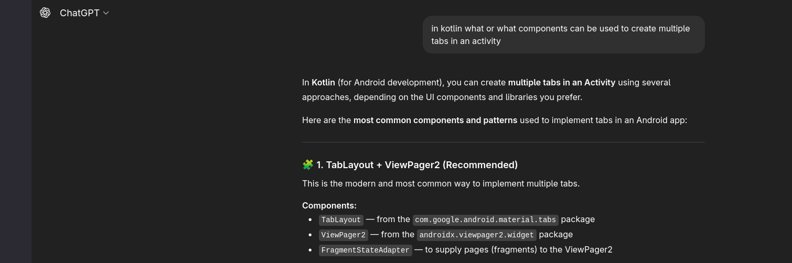
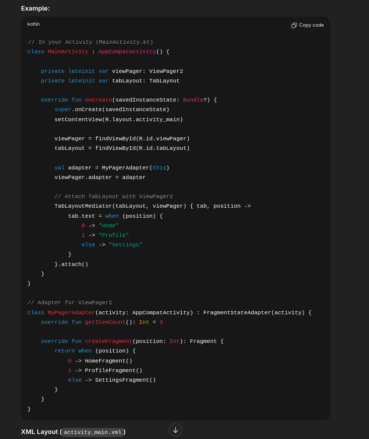
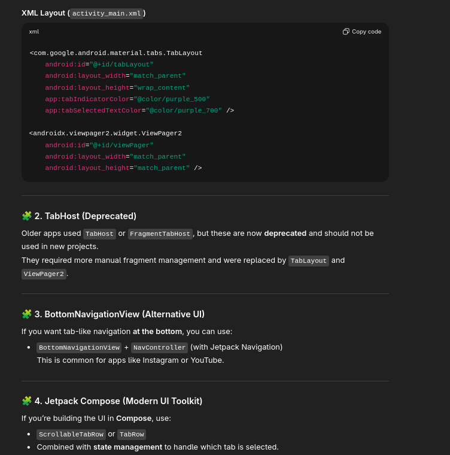
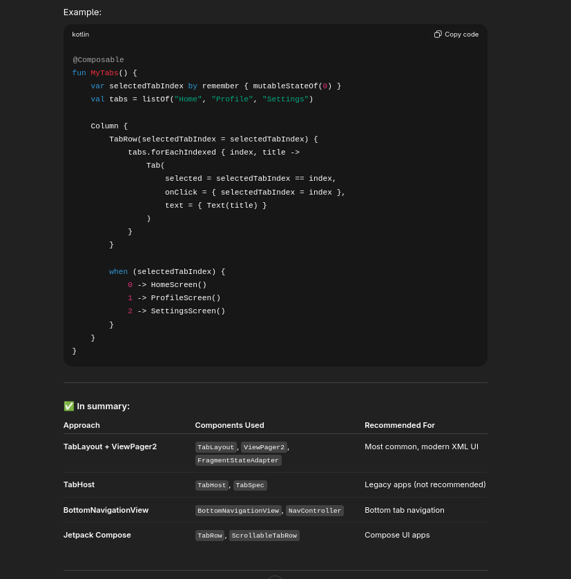
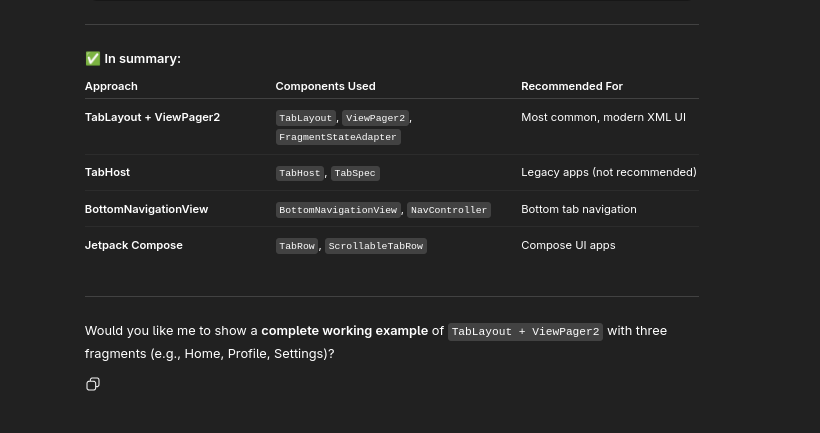

# References

## Saving to Json:
  - https://kotlinlang.org/docs/serialization.html#formats
  - https://www.baeldung.com/kotlin/write-file

## Tabs / Fragments
  - https://www.geeksforgeeks.org/android/how-to-implement-tabs-viewpager-and-fragment-in-android-using-kotlin/
    
  
  
  
  
  

## Dark Mode:
  - https://www.geeksforgeeks.org/android/how-to-create-a-dark-mode-for-a-custom-android-app-in-kotlin/

## Language:
  - https://stackoverflow.com/questions/65662126/kotlin-how-to-change-the-locale

## Bottom Sheet Dialog:
  - https://www.geeksforgeeks.org/kotlin/android-bottomsheet-example-in-kotlin/

## Lambdas:
  - https://kotlinlang.org/docs/lambdas.html#instantiating-a-function-type

